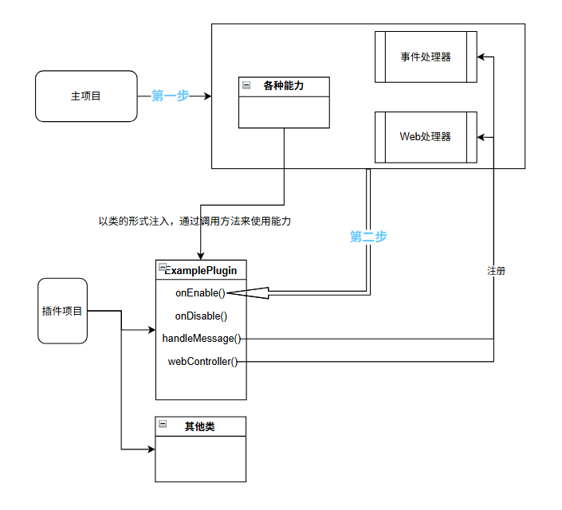
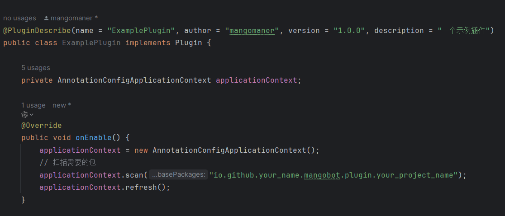

# 能力注入

## 简介
MangoBot 主要依赖注解（ `@xxx`格式的内容 ）进行能力的注入

主项目加载插件时，会读取插件类（[创建插件](/development/plugin.html)中实现Plugin接口的类，后续用**插件类**来代指）的信息，并将插件类定义的消息接收、Web功能的函数注入到主项目（因此，需要注解来告诉主项目，我的函数/类是干什么的）

同时，主项目也会为你的插件类注入功能，例如 OneBotApiService，可以一键调用api来向QQ发送消息



**注意！**所有下列提到的内容只在插件类中使用，在别处使用无效

## 插件信息标识

### @PluginDescribe

描述插件的基本信息，注解在类上：

```java
@MangoBot
@PluginDescribe(
    name = "ExamplePlugin",           // 插件名称
    author = "yourname",         // 作者
    version = "1.0.0",          // 版本
    description = "我的第一个插件" // 描述
)
public class ExamplePlugin implements Plugin {
    // ...
}
```

## 发送消息

### @MangoBotApiService

注入 OneBotApiService，用于调用机器人 API 以发送消息，注解在属性上：

```java
@MangoBotApiService
private OneBotApiService oneBotApiService;
```

对于群组、私聊消息，请参考 [消息构建](/development/message_build.html) 来组织要发送的内容

## 事件监听（接收消息）

### @MangoBotEventListener

标记方法为事件监听器，用于接收消息，注解在方法上：

注意，监听器方法必须返回一个布尔值，表示是否继续向下传播事件（true为继续）。

### @PluginPriority

控制监听器的执行顺序，数值越小优先级越高（默认优先级为10）：

```java
@MangoBotEventListener
@PluginPriority(10)
public boolean handleMessage(GroupMessageEvent event) {
    System.out.println("收到消息: " + event.getMessage());
    return true;
}
```

#### 参数规则

- 方法参数必须是 `Event` 的子类，仅支持传入Event这一个参数
- 支持的事件类型：
    - `GroupMessageEvent` - 群消息
    - `PrivateMessageEvent` - 私聊消息
    - `PokeEvent` - 戳一戳通知
    - `GroupRecallEvent` - 群撤回消息通知
    - `GroupIncreaseEvent` - 群成员增加通知
    - `GroupDecreaseEvent` - 群成员减少通知
    - `GroupBanEvent` - 群禁言通知
    - `EssenceEvent` - 群精华消息通知

#### 返回值

- `boolean` - 返回 `false` 将中断事件传播，后续优先级较低的监听器将不会收到该事件

更为详细的信息请参考 [事件系统](/development/event.html)

---

至此，示例如下：


## Web 接口

如果你想为插件提供HTTP访问功能/开发前端，插件可以定义 HTTP 接口，通过 `@MangoBotRequestMapping` 注解，支持类注解和方法注解，与 SpringMVC 的开发基本一致：

```java
@MangoBotRequestMapping(value = "/my-plugin", method = MangoRequestMethod.GET)
public String hello() {
    return "Hello from my plugin!";
}

@MangoBotRequestMapping(value = "/my-plugin/info", method = MangoRequestMethod.POST)
public String getInfo(@MangoBotRequestBody String data) {
    return "Received: " + data;
}
```


### @MangoBotRequestMapping

定义接口路径和请求方法：

- `value` - 接口路径
- `method` - 请求方法（GET/POST）

### @MangoBotRequestBody

标记方法参数为请求体：

```java
public String handleRequest(@MangoBotRequestBody String body) {
    // 处理请求体
}
```

### @MangoBotPathVariable

标记方法参数为路径变量：

```java
public String getUserInfo(@MangoBotPathVariable String userId) {
    // 处理路径参数
}
```

## 完整示例

以下是一个完整的插件示例：

```java
package io.github.mangomaner.mangobot.plugin.example;

import io.github.mangomaner.mangobot.annotation.MangoBot;
import io.github.mangomaner.mangobot.annotation.MangoBotApiService;
import io.github.mangomaner.mangobot.annotation.PluginDescribe;
import io.github.mangomaner.mangobot.annotation.PluginPriority;
import io.github.mangomaner.mangobot.annotation.messageHandler.MangoBotEventListener;
import io.github.mangomaner.mangobot.annotation.web.MangoBotRequestMapping;
import io.github.mangomaner.mangobot.annotation.web.MangoRequestMethod;
import io.github.mangomaner.mangobot.model.onebot.event.message.GroupMessageEvent;
import io.github.mangomaner.mangobot.model.onebot.event.message.PrivateMessageEvent;
import io.github.mangomaner.mangobot.plugin.Plugin;
import io.github.mangomaner.mangobot.service.OneBotApiService;
import org.springframework.context.annotation.AnnotationConfigApplicationContext;
import java.util.logging.Logger;

@MangoBot
@PluginDescribe(
    name = "ExamplePlugin",
    author = "mangomaner",
    version = "1.0.0",
    description = "一个示例插件"
)
public class ExamplePlugin implements Plugin {
    
    private static final Logger logger = Logger.getLogger("ExamplePlugin");
    private AnnotationConfigApplicationContext applicationContext;

    @MangoBotApiService
    private OneBotApiService oneBotApiService;

    @Override
    public void onEnable() {
    }

    @Override
    public void onDisable() {
    }

    @MangoBotEventListener
    @PluginPriority(5)
    public boolean onGroupMessage(GroupMessageEvent event) {
        logger.info("收到群消息: " + event.getRawMessage());
        return false;
    }

    @MangoBotEventListener
    @PluginPriority(10)
    public void onPrivateMessage(PrivateMessageEvent event) {
        logger.info("收到私聊消息: " + event.getRawMessage());
    }

    @MangoBotRequestMapping(value = "/hello", method = MangoRequestMethod.GET)
    public String hello() {
        return "Hello from ExamplePlugin!";
    }
}
```

## 使用SpringBoot

如果你正在开发较为复杂的项目，或你习惯于SpringBoot开发，可以按照如下示例使用SpringBoot：

```java
private AnnotationConfigApplicationContext applicationContext;

@Override
public void onEnable() {
    applicationContext = new AnnotationConfigApplicationContext();
    // 扫描org.mango包
    applicationContext.scan("io.github.your_name.mangobot.plugin.your_project_name");
    applicationContext.refresh();
}
```


