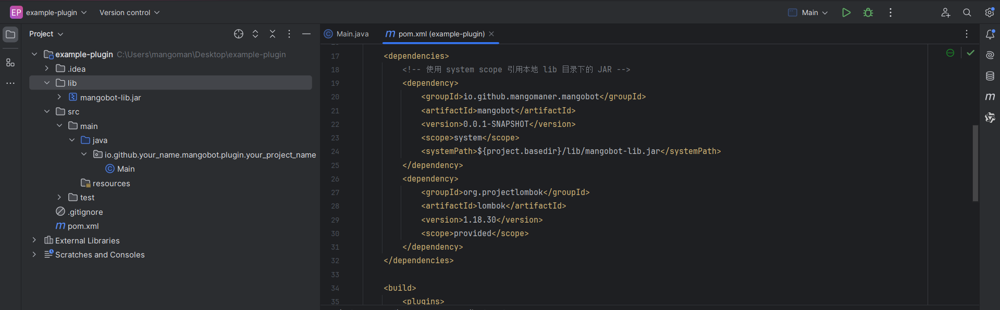

# 创建插件

MangoBot 拥有强大的插件系统，允许你将功能封装在独立的 JAR 包中。

## 插件概述

插件是 MangoBot 的核心扩展机制。每个插件都是一个独立的 JAR 文件，可以动态加载和卸载，无需重启主程序。

### 插件特性

- **动态加载**：运行时动态加载 JAR 插件，支持热插拔
- **独立生命周期**：每个插件都有自己的启用和禁用回调
- **事件监听**：通过注解监听各类消息事件
- **Web 接口**：支持在插件中定义 HTTP 接口
- **API 注入**：可以注入 OneBotApiService 来调用机器人 API
- **优先级控制**：支持设置事件监听器的执行优先级

## 创建插件项目

### 创建项目

创建一个标准的 Maven 项目，请注意，GroupId的命名空间格式**必须**为：

`io.github.{your_name}.mangobot.plugin.{your_project_name}`：


### pom.xml 配置

初始化后，项目的 pom.xml 文件如下：


我们在pom.xml同级目录新建一个lib文件夹，内部放入 `mangobot-lib.jar` 文件，并在右侧红框部分添加如下内容：

```xml
<dependencies>
  <!-- 使用 system scope 引用本地 lib 目录下的 JAR -->
  <dependency>
    <groupId>io.github.mangomaner.mangobot</groupId>
    <artifactId>mangobot</artifactId>
    <version>0.0.1-SNAPSHOT</version>
    <scope>system</scope>
    <systemPath>${project.basedir}/lib/mangobot-lib.jar</systemPath>
  </dependency>
  <dependency>
    <groupId>org.projectlombok</groupId>
    <artifactId>lombok</artifactId>
    <version>1.18.30</version>
    <scope>provided</scope>
  </dependency>
</dependencies>

<build>
  <plugins>
    <!-- 打包插件（system 依赖默认不会被打包） -->
    <plugin>
      <groupId>org.apache.maven.plugins</groupId>
      <artifactId>maven-shade-plugin</artifactId>
      <version>3.5.0</version>
      <executions>
        <execution>
          <phase>package</phase>
          <goals>
            <goal>shade</goal>
          </goals>
        </execution>
      </executions>
      <configuration>
        <createDependencyReducedPom>false</createDependencyReducedPom>
      </configuration>
    </plugin>
  </plugins>
</build>
```

至此，我们的文件结构应该如下所示：


## 插件接口

每个插件**必须且仅能**实现一个 `Plugin` 接口，禁止在插件类中定义有参构造函数：

```java
public class ExamplePlugin implements Plugin {
    @Override
    public void onEnable() {
    }

    @Override
    public void onDisable() {
    }
}
```

### onEnable()

插件加载成功后调用，用于初始化插件资源、注册监听器等。

同时，请删除Main.java文件，因为插件启用时，会自动调用onEnable()方法，相当于正常开发时的main函数。

### onDisable()

插件卸载或禁用时调用，用于清理资源、关闭连接等。


## 打包与部署

### 打包

使用 Maven 打包插件：

```bash
mvn clean package
```

打包完成后，在 `target` 目录下会生成 JAR 文件。

### 部署

1. 将生成的与项目名相同的 JAR 文件复制到 MangoBot 运行目录下的 `plugins` 文件夹
2. 查看日志确认插件加载成功

### 插件目录结构

```
MangoBot-cli/
├── MangoBot-cli.jar
├── plugins/              <-- 将你的插件 JAR 包放在这里
│   ├── example-plugin-1.0.jar
│   └── my-plugin-1.0.jar
└── application.yml
```

## 常见问题

### Q: 

A: 


