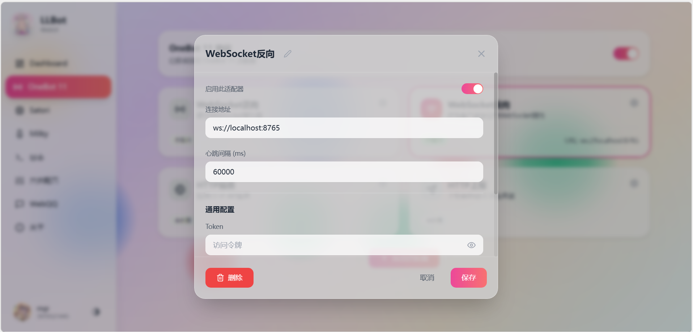
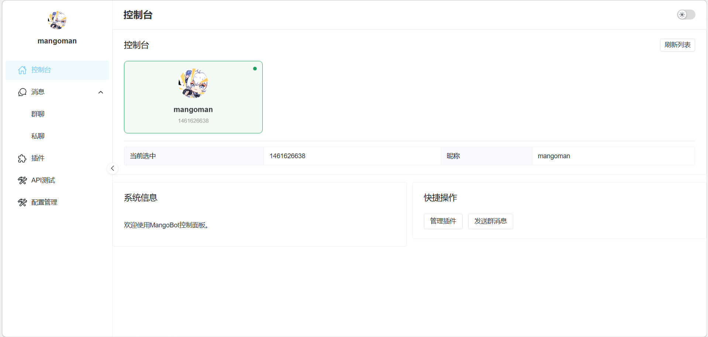

# 快速开始

本指南将帮助你快速搭建并运行 MangoBot。

## 环境要求

- JDK 17+
- 一个支持 OneBot 11 协议的客户端（如 LLOneBot, NapCat 等）

## 运行步骤

### 1. 下载与启动

首先，下载Release到本地：

```
https://github.com/mangomaner/MangoBot-cli/releases
```

解压后双击运行`start.bat`文件，等待启动完成后浏览器输入如下网址

```
http://localhost:8765
```


### 2. 配置 OneBot 客户端

在你的 OneBot 客户端（如 [LLOneBot](https://github.com/LLOneBot)）中，配置反向 WebSocket 地址：

- URL: `ws://localhost:8765/` 
- 启用反向 WebSocket 服务


### 3. 验证连接

启动成功后，浏览器控制台将显示你的账号：



这表示 MangoBot 已成功连接到你的 OneBot 客户端。尝试给机器人发送消息，看看是否有响应。

### 4. 加载插件

将插件 JAR 文件放置在运行目录下的 `plugins` 文件夹中，MangoBot 会自动加载插件。

```
MangoBot-cli/
├── mangobot-0.0.1-SNAPSHOT.jar
├── plugins/              <-- 将你的插件 JAR 包放在这里
│   ├── example-plugin-1.0.jar
│   └── my-plugin-1.0.jar
└── application.yml
```

## 配置说明

在`配置管理`页进行配置


## 下一步

- 查看 [插件开发](/development/plugin) 了解如何开发插件
- 查看 [API 参考](/development/api) 了解可用的 API
- 查看 [事件系统](/development/event) 了解事件处理机制
